# Monitoring with Grafana and Prometheus (Onprem-only)
- Document creation date: 04/07/2023
- Author: VinhLT
- Version 1.0
- Changelogs
  - 04/07/2023-v1.0: Document creation

## Background
### What is Observability?
**Observability** is the extent to which the internal states of a system can be inferred from externally available data. 

An observable software system provides the ability to understand any issue that arises. Conventionally, the three pillars of observability data are `metrics`, `logs` and `traces`

### Why Observability is important?

Maintain existing system always a challenge. There are various of component (Hardwares, Applications, Network...) need to be supervised in order to analyze its performance, and to detect and alert about possible errors

Those component may and may not came up with their owns ways to view and tracking performance, sperately from each other.

Therefore, in term of big picture, a solution to group up those sperately component info, and visualize it is needed.

### Differentiating Observability and Visibility
`Visibility` allows development teams to `look at the surface-level aspects of an application or system`. 

In contrast, `observability` provides deeper `insight into what an application is doing in production`. 

Being equipped with a deep knowledge of observability allows developers to be more productive within their respective organizations.
## Table of contents
- [Monitoring with Grafana and Prometheus (Onprem-only)](#monitoring-with-grafana-and-prometheus-onprem-only)
  - [Background](#background)
    - [What is Observability?](#what-is-observability)
    - [Why Observability is important?](#why-observability-is-important)
    - [Differentiating Observability and Visibility](#differentiating-observability-and-visibility)
  - [Table of contents](#table-of-contents)
  - [Basic concept - Three pillars of observability](#basic-concept-three-pillars-of-observability)
    - [What are metrics?](#what-are-metrics)
    - [What are logs?](#what-are-logs)
    - [What are traces?](#what-are-traces)
  - [Grafana Ecosystem](#grafana-ecosystem)
    - [Grafana](#grafana)
    - [Grafana Loki](#grafana-loki)
    - [Grafana Tempo](#grafana-tempo)
    - [Other opensource products](#other-opensource-products)
      - [Grafana Agent](#grafana-agent)
      - [Prometheus](#prometheus)
      - [OpenTelemetry](#opentelemetry)
      - [Grafana Mimir](#grafana-mimir)
      - [Grafana OnCall](#grafana-oncall)
      - [Grafana Phlare](#grafana-phlare)
  - [Example](#example)
      - [Prequire system](#prequire-system)
      - [Install \& config Statsd Exporter](#install-config-statsd-exporter)
      - [Installing \& config Prometheus](#installing-config-prometheus)
      - [Installing Grafana](#installing-grafana)
      - [Install Loki](#install-loki)
      - [Install Tempo](#install-tempo)
      - [Install \& config Grafana Agent](#install-config-grafana-agent)
    - [Config airflow metrics to Prometheus](#config-airflow-metrics-to-prometheus)
    - [Config system metrics (Node Exporter) to Prometheus](#config-system-metrics-node-exporter-to-prometheus)
    - [Send custom metrics to prometheus example](#send-custom-metrics-to-prometheus-example)
    - [Config grafana Agent to read logs and push to Loki](#config-grafana-agent-to-read-logs-and-push-to-loki)
    - [Sample tracing with Grafana agent and Tempo](#sample-tracing-with-grafana-agent-and-tempo)
      - [Setup sample project](#setup-sample-project)
      - [Config Grafana Agent](#config-grafana-agent)
      - [Explore Grafana](#explore-grafana)
    - [Create Grafana dashboard using metrics collected](#create-grafana-dashboard-using-metrics-collected)
      - [Config datasource](#config-datasource)
      - [Dashboard](#dashboard)
    - [Alerting with Grafana](#alerting-with-grafana)
  - [Extra stuff](#extra-stuff)
    - [What is *Monitoring Dashboard*](#what-is-monitoring-dashboard)
    - [What make a good *Monitoring Dashboard*](#what-make-a-good-monitoring-dashboard)
    - [Logging best practice](#logging-best-practice)
    - [Custom Tracing best practice](#custom-tracing-best-practice)

## Basic concept - Three pillars of observability
### What are metrics?
In layperson terms, metrics are numeric measurements. Time series means that changes are recorded over time. What users want to measure differs from application to application. For a web server it might be request times, for a database it might be number of active connections or number of active queries etc.

### What are logs?
A log, in a computing context, is the `automatically produced and time-stamped documentation of events` relevant to a particular system. Virtually all software applications and systems produce log files.

### What are traces?
A trace represents the `whole journey of a request or an action` as it moves through all the nodes of a distributed system, especially containerized applications or microservices architectures. Traces let you profile and observe systems, making it easy to discover bottlenecks and interconnection issues.

A span represents a unit of work or operation. Spans are the building blocks of Traces. Here is example of a span [opentelemery document](https://opentelemetry.io/docs/concepts/signals/traces/#spans)
```json
{
  "name": "hello-greetings",
  "context": {
    "trace_id": "0x5b8aa5a2d2c872e8321cf37308d69df2",
    "span_id": "0x5fb397be34d26b51"
  },
  "parent_id": "0x051581bf3cb55c13",
  "start_time": "2022-04-29T18:52:58.114304Z",
  "end_time": "2022-04-29T22:52:58.114561Z",
  "attributes": {
    "http.route": "some_route1"
  },
  "events": [
    {
      "name": "hey there!",
      "timestamp": "2022-04-29T18:52:58.114561Z",
      "attributes": {
        "event_attributes": 1
      }
    },
    {
      "name": "bye now!",
      "timestamp": "2022-04-29T18:52:58.114585Z",
      "attributes": {
        "event_attributes": 1
      }
    }
  ]
}
```


## Grafana Ecosystem
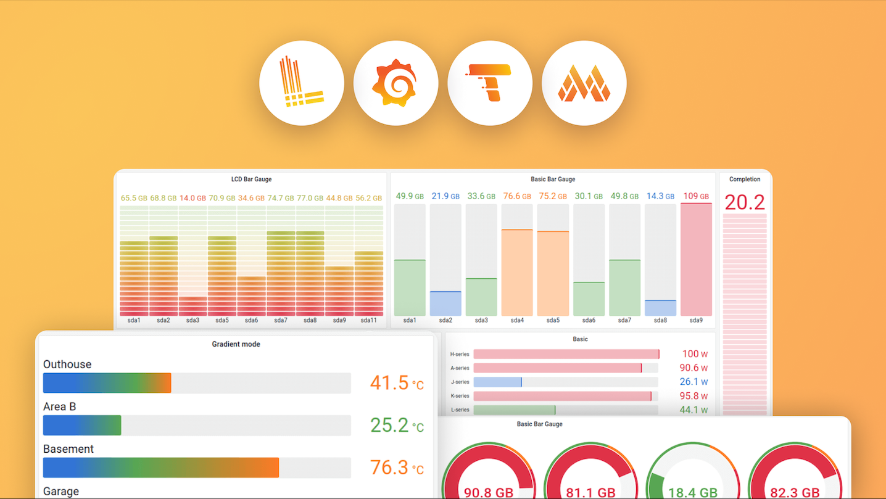

### [Grafana](https://github.com/grafana/grafana)
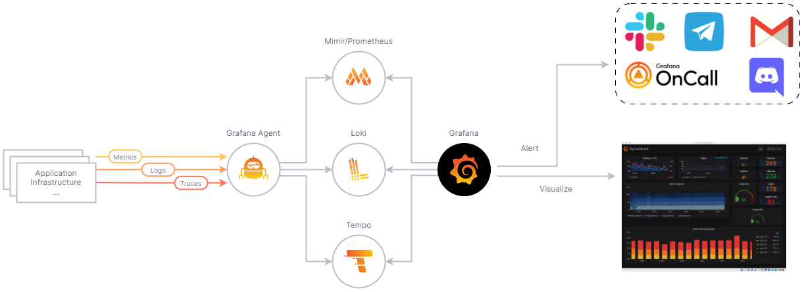
Query, visualize, alert on and understand your metrics no matter where they are stored. Create, explore, and share dashboards with your team and foster a data-driven culture:
- **Visualizations:** Fast and flexible client side graphs with a multitude of options. Panel plugins offer many different ways to visualize metrics and logs.
- **Dynamic Dashboards:** Create dynamic & reusable dashboards with template variables that appear as dropdowns at the top of the dashboard.
- **Explore Metrics:** Explore your data through ad-hoc queries and dynamic drilldown. Split view and compare different time ranges, queries and data sources side by side.
- **Explore Logs:** Experience the magic of switching from metrics to logs with preserved label filters. Quickly search through all your logs or streaming them live.
- **Alerting:** Visually define alert rules for your most important metrics. Grafana will continuously evaluate and send notifications to systems like Slack, PagerDuty, VictorOps, OpsGenie.
- **Mixed Data Sources:** Mix different data sources in the same graph! You can specify a data source on a per-query basis. This works for even custom datasources.
### [Grafana Loki](https://github.com/grafana/loki)

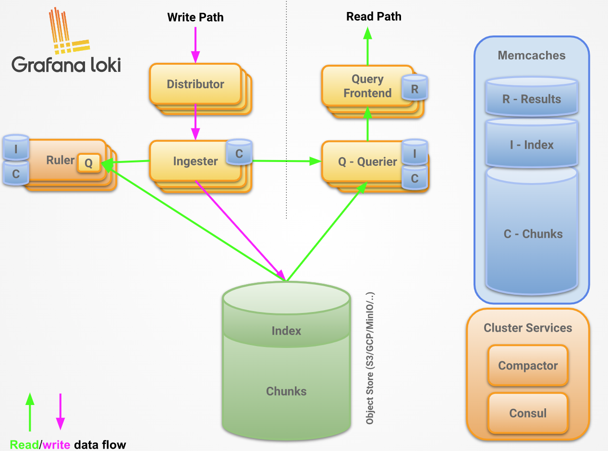

Grafana Loki is a set of components that can be composed into a fully featured logging stack.

Unlike other logging systems, Loki is built around the idea of only indexing metadata about your logs: labels (just like Prometheus labels). Log data itself is then compressed and stored in chunks in object stores such as S3 or GCS, or even locally on the filesystem. A small index and highly compressed chunks simplifies the operation and significantly lowers the cost of Loki.
### [Grafana Tempo](https://github.com/grafana/tempo)

Grafana Tempo is an open source, easy-to-use, and high-volume distributed tracing backend. Tempo is cost-efficient, and only requires an object storage to operate. Tempo is deeply integrated with Grafana, Mimir, Prometheus, and Loki. You can use Tempo with open-source tracing protocols, including Jaeger, Zipkin, or OpenTelemetry.

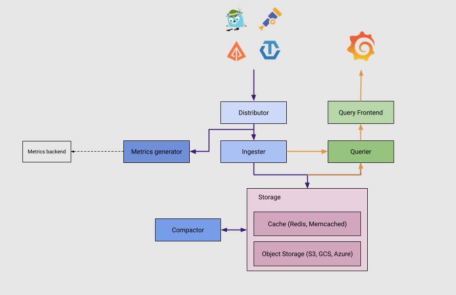

### Other opensource products
#### [Grafana Agent](https://github.com/grafana/agent)
Grafana Agent is a vendor-neutral, batteries-included telemetry collector with configuration inspired by Terraform. It is designed to be flexible, performant, and compatible with multiple ecosystems such as Prometheus and OpenTelemetry.

Grafana Agent is based around components. Components are wired together to form programmable observability pipelines for telemetry collection, processing, and delivery.

#### [Prometheus](https://prometheus.io/)
Open-source systems monitoring and alerting toolkit 

Collects and stores its metrics as time series data. Metrics information is stored with the timestamp at which it was recorded, alongside optional key-value pairs called labels.

Main feature
  - A multi-dimensional data model with time series data identified by metric name and key/value pairs
  - PromQL, a flexible query language to leverage this dimensionality
  - No reliance on distributed storage; single server nodes are autonomous
  - Time series collection happens via a pull model over HTTP
  - Pushing time series is supported via an intermediary gateway
  - Targets are discovered via service discovery or static configuration
  - Multiple modes of graphing and dashboarding support

Components
  - The main Prometheus server which scrapes and stores time series data
  - Client libraries for instrumenting application code
  - A push gateway for supporting short-lived jobs
  - Special-purpose exporters for services like HAProxy, StatsD, Graphite, etc.
  - An alertmanager to handle alerts
  - Various support tools

#### [OpenTelemetry](https://opentelemetry.io/)
A collection of tools, APIs, and SDKs, OpenTelemetry helps engineers instrument, generate, collect, and export telemetry data such as metrics, logs, and traces, in order to analyze software performance and behavior.

OpenTelemetry offers vendor-neutral open source tools, SDKs, and standards for application observability. This is a perfect match for Grafana’s open big tent approach. Bringing together infrastructure and platform telemetry like Kubernetes’ Prometheus metrics and application telemetry in a single unified open source monitoring backend bridges the gap between operations and application developers, and it provides new ways of collaboration and insights.

#### [Grafana Mimir](https://github.com/grafana/mimir)
Grafana Mimir is an open source software project that provides a scalable long-term storage for `Prometheus`
#### [Grafana OnCall](https://github.com/grafana/oncall)
Grafana OnCall is an open source incident response management tool built to help teams improve their collaboration and resolve incidents faster.


#### [Grafana Phlare](https://github.com/grafana/phlare)
Grafana Phlare is an open source software project for aggregating continuous profiling data. Continuous profiling is an observability signal that allows you to understand your workload's resources (CPU, memory, etc...) usage down to the line number.


## Example
#### Prequire system
  - Hadoop cluster integrated with Ambari. Ambari Metric is installed
  - Apache Airflow
  - Enviroment to run python code 
  - Enviroment to run Docker container
#### Install & config Statsd Exporter
[**Link github**](https://github.com/prometheus/statsd_exporter)

The StatsD exporter is a drop-in replacement for StatsD. This exporter translates StatsD metrics to Prometheus metrics via configured mapping rules.

- Create `statsd_mapping.yml` file. [File content](statsd_exporter/statsd_mapping.yml)

- Create and run Statsd Exporter container from docker image. 
    ```bash
    docker run --name statsd_exporter -d -p 9102:9102 -p 9125:9125 -p 9125:9125/udp -v <path_to_configfile>/statsd_mapping.yml:/tmp/statsd_mapping.yml prom/statsd-exporter --statsd.mapping-config=/tmp/statsd_mapping.yml --statsd.listen-udp=":9125" --statsd.listen-tcp=":9125" --web.listen-address=":9102"
    ```
- To get all metrics: `http://<docker-host>:9102/metrics`
#### Installing & config Prometheus
[**Link reference**]([https://](https://hub.docker.com/r/prom/prometheus))

- Run docker container
    ```bash
    docker run --name prometheus -d -p 9092:9090 -v <path_to_configfile>/prometheus.yml:/etc/config/prometheus.yml prom/prometheus --config.file=/etc/config/prometheus.yml --web.enable-lifecycle --web.enable-remote-write-receiver
    ```
- [prometheus.yml](prometheus/prometheus.yml)
#### Installing Grafana
[**Link reference**](https://grafana.com/docs/grafana/latest/setup-grafana/installation/docker/)

- Run docker container
    ```bash
    docker run --name grafana -d -p 3000:3000 -e "https_proxy=http://squid-rh8.vndirect.com.vn:80" -e "GF_INSTALL_PLUGINS=praj-ams-datasource" grafana/grafana-enterprise
    ```
  - set enviroment_variable `"GF_INSTALL_PLUGINS=praj-ams-datasource" grafana/grafana-enterprise` to install additional plugin
  - set proxy to to connect to internet 
#### Install Loki

- Docker container
    ```bash
    docker run --name loki -d -v <path_to_configfile>/loki-config.yaml:/mnt/config/loki-config.yaml -p 3100:3100 grafana/loki:2.8.0 -config.file=/mnt/config/loki-config.yaml
    ```
- Config file: [loki-config.yaml](loki/loki-config.yaml)
#### Install Tempo
- Docker container
    ```
    docker run --name tempo -d -p 8004:80 -p 55680:4316 -p 55681:4317  -v <path_to_configfile>/tempo.yaml:/etc/tempo.yaml grafana/tempo -config.file=/etc/tempo.yaml --target=all --auth.enabled=false --distributor.log-received-traces=true --enable-go-runtime-metrics=true
    ```
- [tempo.yaml](tempo/tempo.yaml)
#### Install & config Grafana Agent
- Install & config: [Link Document](https://grafana.com/docs/agent/latest/static/set-up/install/install-agent-linux/)
- Start Grafana Agent
    ```bash
    sudo systemctl start grafana-agent
    ```
- Check logs
    ```bash
    sudo journalctl -u grafana-agent -f
    ```
### Config airflow metrics to Prometheus
Airflow will sent metric to Statsd_exporter server. Grafana agent will pull metrics from statsd_exporter, then push to Prometheus
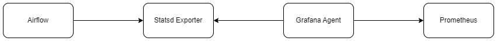
- Config `Airflow` push metric to `statsd`
    ```yml
    [metrics]
    statsd_on = True
    statsd_host = <statsd-exporter-host>
    statsd_port = <statsd-exporter-port> # default 9125
    statsd_prefix = airflow
    ```
- Config grafana Agent `/etc/grafana-agent.yaml`
    ```yml
    metrics:
      wal_directory: '/var/lib/grafana-agent'
      global:
        scrape_interval: 1m
        remote_write:
        - url: http://<prometheus-host>:9092/api/v1/write
      configs:
        - name: agent
          scrape_configs:
            - job_name: 'fuat-pti-statsd-exporter'
              static_configs:
                - targets: ['<statsd-exporter-host>:9102']
                  labels:
                    infra_name: 'fuat-pti' 
                    component_name: 'airflow'
    ```
### Config system metrics (Node Exporter) to Prometheus
Config grafana Agent `/etc/grafana-agent.yaml`
```yml
integrations:
  agent:
    enabled: true
  node_exporter:
    enabled: true
    include_exporter_metrics: true
```
### Send custom metrics to prometheus example
Using Prometheus Pushgateway, we can create our own metrics

- Run docker
    ```bash
    docker run --name pushgateway -d -p 9089:9091 prom/pushgateway 
    ```
- Create file [ps_aux_pushgateway.sh](custom_metric/ps_aux_pushgateway.sh)
    ```bash
    #!/bin/bash

    z=$(ps aux)
    while read -r z
    do
    var=$var$(awk '{print "cpu_usage{process=\""$11"\", pid=\""$2"\"}", $3z}');
    done <<< "$z"
    curl -X POST -H  "Content-Type: text/plain" --data "$var
    " http://<pushgateway-host>:9089/metrics/job/top/instance/machine 
    ```
- The Pushgateway metrics will look like this
    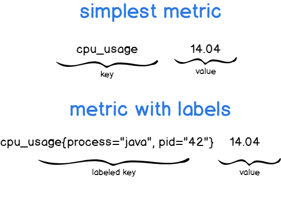

- Here is the metrics we sent
    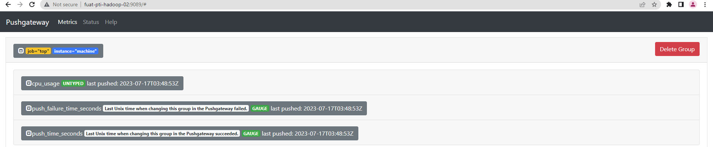
### Config grafana Agent to read logs and push to Loki
- Config grafana Agent `/etc/grafana-agent.yaml`
    ```yml
    logs:
      configs:
      - name: ${HOSTNAME}
        positions:
          filename: /grafana/positions.yaml
    
        scrape_configs:
        - job_name: yarn
          static_configs:
          - targets: 
            - localhost
            labels:
              job: yarn
              __path__: /var/log/hadoop-yarn/yarn/*.log
    
        - job_name: hdfs
          static_configs:
          - targets: 
            - localhost
            labels:
              job: hdfs
              __path__: /var/log/hadoop/hdfs/*.log
        - job_name: hive
          static_configs:
          - targets: 
            - localhost
            labels:
              job: hive
              __path__: /var/log/hive/*.log
        - job_name: airflow
          static_configs:
          - targets: 
            - localhost
            labels:
              job: airflow-dag
              __path__: /root/airflow/logs/*vinhlt*/**/**/*.log
          pipeline_stages:
          - match:
              selector: '{job="airflow-dag"}'
              stages:
              - regex:
                  source: filename
                  expression: "/root/airflow/logs/(?P<dag_name>(.*?))/(?P<step>(.*?))/(?P<run_name>(.*?))/(?P<attempt>[0-9]+).log"
              - labels:
                  dag_name:
                  step: 
                  run_name:
                  attempt:
    ```
### Sample tracing with Grafana agent and Tempo
#### Setup sample project
- Using sample project
    ```bash
    docker run --name fake-tracing -e ENDPOINT=<grafana-agent>:4317 -e HTTP_PROXY=http://squid-rh8.vndirect.com.vn:80 -e HTTPS_PROXY=http://squid-rh8.vndirect.com.vn:80 ghcr.io/grafana/xk6-client-tracing:v0.0.2
    ```
- Customize code
    - Install opentelemetry python package
        ```
        opentelemetry-api==1.12.0
        opentelemetry-exporter-otlp-proto-grpc==1.12.0
        opentelemetry-proto==1.12.0
        opentelemetry-sdk==1.12.0
        opentelemetry-semantic-conventions==0.33b0
        ```
    - Sample code
        - [test1.py](custom_trace/test1.py) 
        - [test2.py](custom_trace/test2.py)
#### Config Grafana Agent
- Config Grafana Agent foward trace to Tempo. Additionaly, automatic logging feature to transform from trace to log
    ```yml
    traces:
      configs:
      - name: ${HOSTNAME}
        receivers:
          otlp:
            protocols:
              grpc: # default 0.0.0.0:4317
              http: # defualt 0.0.0.0:4318
              
        remote_write:
          - endpoint: 10.210.39.204:55681
            insecure: true  # only add this if TLS is not required
        batch:
          timeout: 5s
          send_batch_size: 100

        # ---- automatic logging -----
        automatic_logging: 
          backend: logs_instance
          logs_instance_name: ${HOSTNAME}
          roots: true
          process_attributes:
            - service.name
          span_attributes:
            - span.kind
          labels:
            - service.name
            - span.kind
    ```
#### Explore Grafana
- Tracing using sample project
    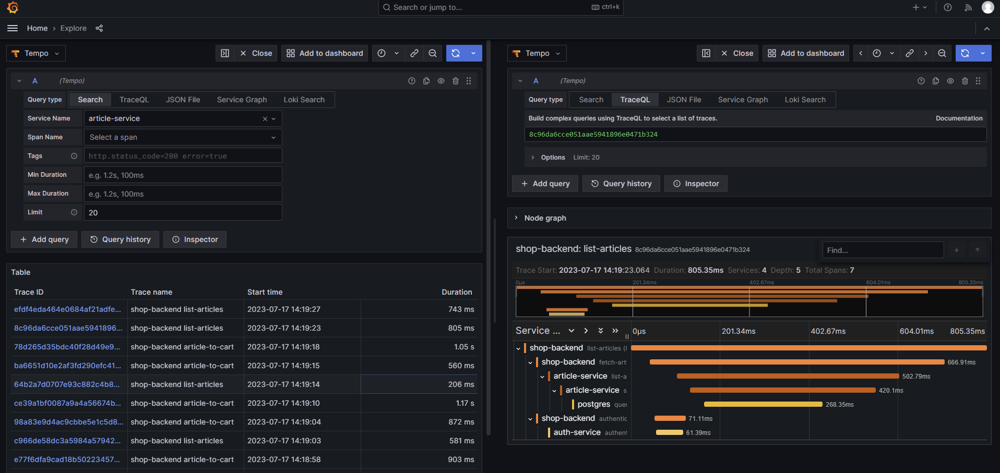

- Customize code
    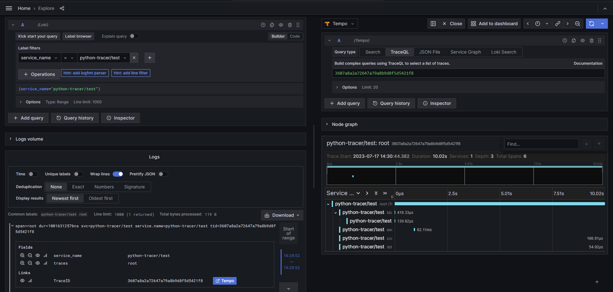

### Create Grafana dashboard using metrics collected
#### Config datasource
- Ambari Metric
    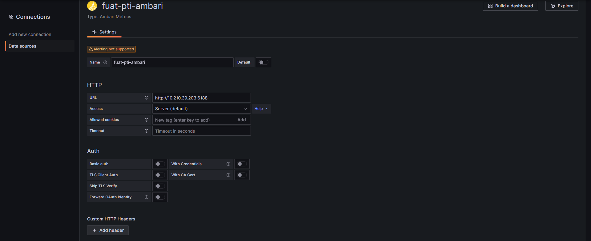
- Loki
    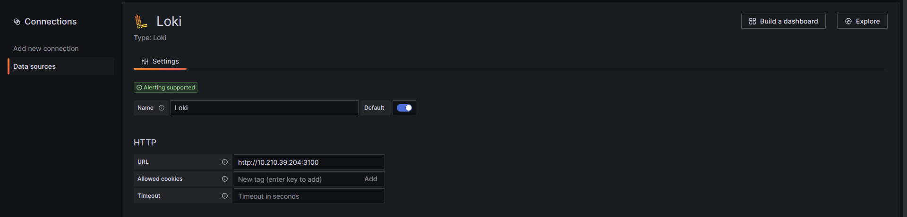
    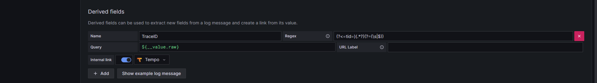

- Tempo
    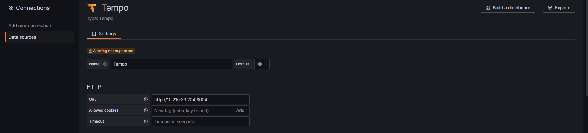
    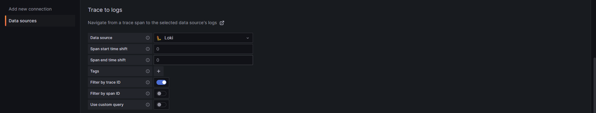
  
- Prometheus
    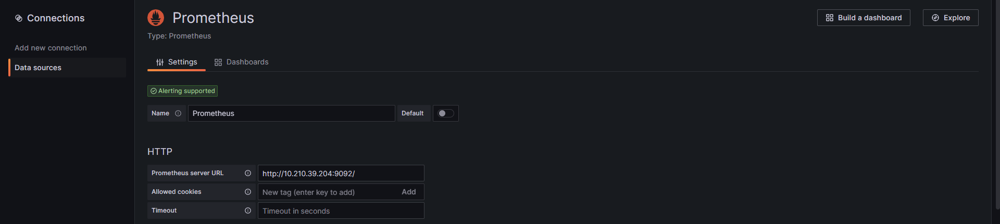

#### Dashboard
- **Import dashboard**  
  - Home -> Dashboard -> Import
  - Example dashboard: [folder](dashboards/)
- **Dashboard versioning**: Whenever you save a version of your dashboard, a copy of that version is saved. You can access version by navigate to `dashboard -> setting -> version`
    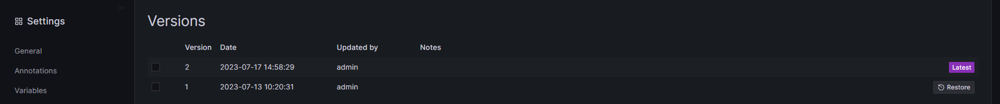

### Alerting with Grafana
- Create contact point
    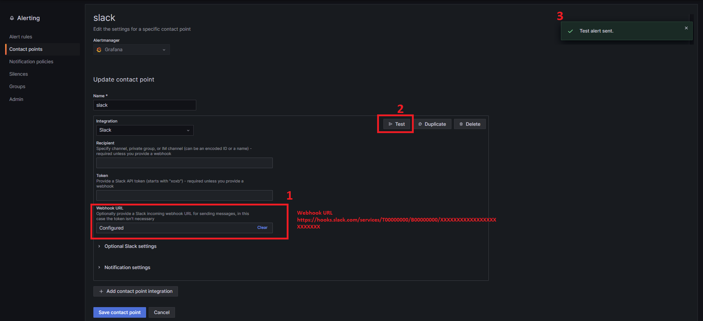
- Config alerting rule
    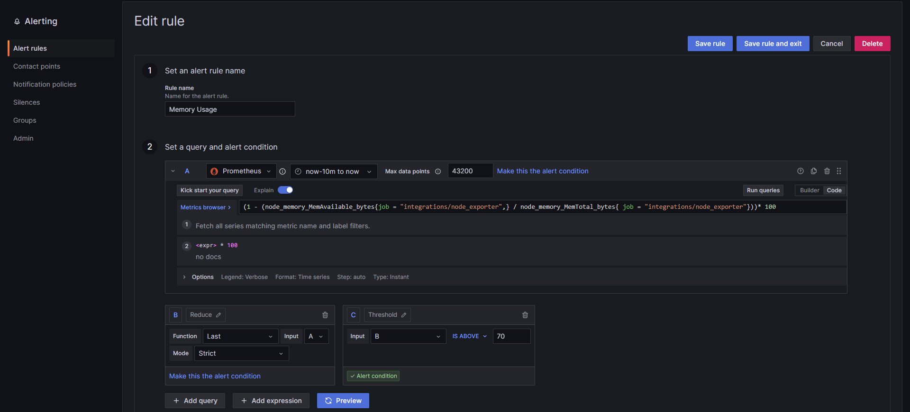
    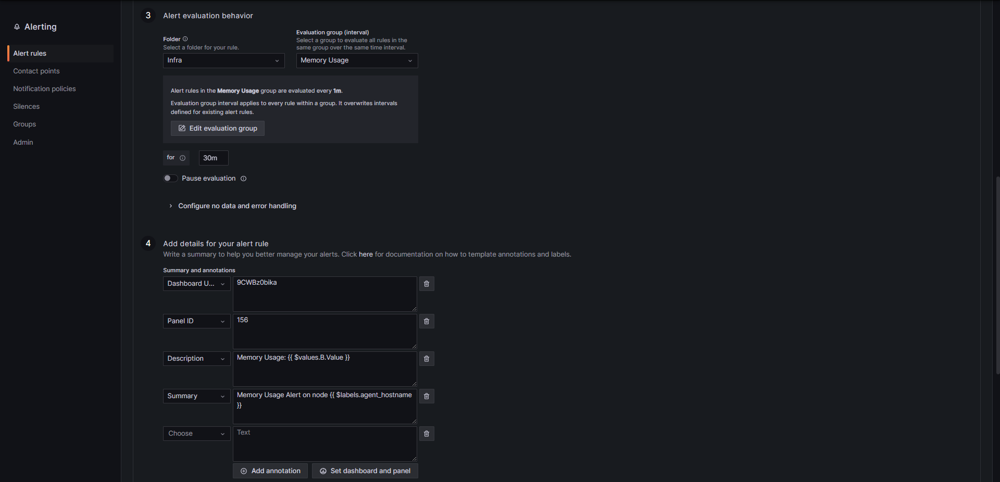
- Here is sneak peek what have fired
    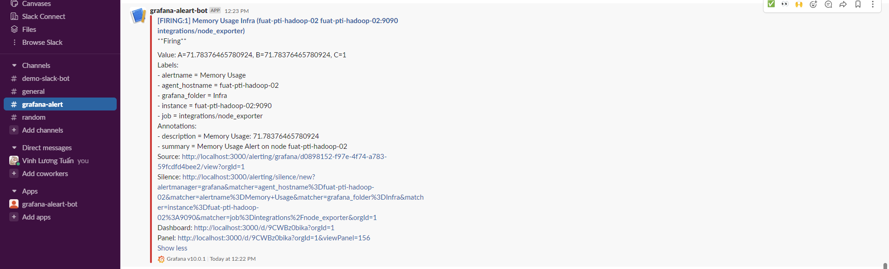


## Extra stuff
### What is *Monitoring Dashboard*
A monitoring dashboard is a set of metric groups or custom views that you can use to monitor the performance of the systems defined in the System Status task. A dashboard does not contain any performance data; it is a template that you can save and reuse, as needed.

### What make a good *Monitoring Dashboard*
<details>
    <summary><b>Focus on the end user, not data</b></summary>

A CEO of a company probably isn’t interested in a summary of test failures, while the DevOps team won’t benefit by using a high-level summary dashboard.


`It is very important to know who will using dashboard. By looking at the user’s perspective, you can determine the critical functions and what exactly the end user expects when they access the dashboard.`
</details>

<details>
    <summary><b>Group data logically and use space wisely</b></summary>
A well-designed dashboard will ensure the data is displayed in logical groups. The data should be grouped into relevant categories. Moreover, the dashboard should not look empty or too cluttered.

The top-left conner of a dashboard should be reserved for filter or important information. The different visual components on the page must be placed based on its relevance to the user, starting from the most important (chart, graph, or dataset) to the least.
</details>
<details>
    <summary><b>Help the user drill down data</b></summary>
A good Dashboard should provided a concise overview on the first page of the dashboard so the user can see what is important and drill down to the data to understand it better.

```A good dashboard should be like a quality newspaper. You pick up the newspaper, glance at the front page and get a gist of everything happening. If you want to know more, then continue reading.The front page of the newspaper offers a pretty good summary of everything it contains.```
</details>

<details>
    <summary><b>Design insightful visualization</b></summary>
It is always better to display a graph, chart, or any visual representation of the data instead of listing it out line by line.

The data visualization should be flexible and the user should be able to customize and filter the data as needed. The charts/graphs should also be insightful and interactive.

Along with the charts, the dashboard should display other important data. This data can be integrated into the dashboard using dialog boxes, overlays, tooltips, etc. These features will add to the visual appeal of the dashboard and make it easy to navigate.
</details>

<details>
    <summary><b>Use color-based visualization</b></summary>
A dashboard should use different colors to indicate errors, warnings, and other messages. For example, a data point or value in red could indicate an error with the data. Similarly, text highlight in orange could indicate a warning message or in green to indicate a success message.
</details>

<details>
    <summary><b>Keep the dashboard clear and uncluttered</b></summary>
Avoid adding too many charts and images to the dashboard. It is easier to navigate a dashboard that is not cluttered with graphs, videos, and other data.

To avoid crowding the dashboard, you can add multiple pages instead of clubbing all the visualization into a single page.

</details>

### [Logging best practice](https://levelup.gitconnected.com/9-logging-best-practices-da9457e33305)

### [Custom Tracing best practice](https://www.ibm.com/docs/en/instana-observability/current?topic=tracing-best-practices)